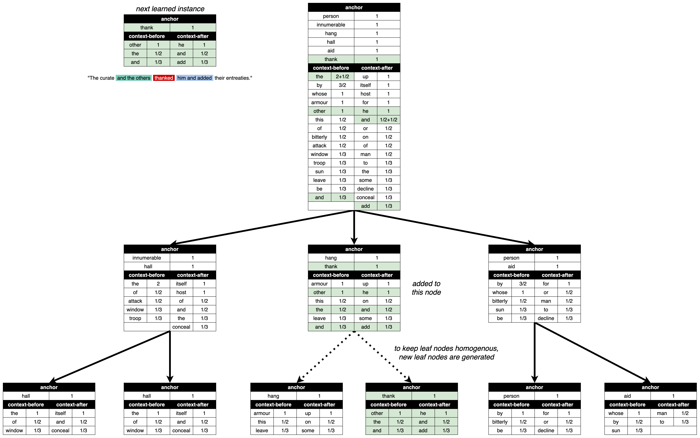

# Cobweb/4L in Language Tasks

The implementation of **Cobweb/4L** use in language tasks. This `README.md` file is pdated on May 14, 2024 by Xin Lian.

The associated ACS-24 paper: to be updated

<figure>
    
    <figcaption>The process of how Cobweb/4L learns an additional new instance after learning 6 instances. The process is indeed the same as the one in Cobweb (but here in particular, the information-theoretic category utility is used for evaluating the operation for each traversed concept node).</figcaption>
</figure>

### Prerequisites 

- Install the `cobweb` Python package [here](https://github.com/Teachable-AI-Lab/cobweb).
- Install the [spaCy](https://spacy.io/usage) package and download the tokenizer `en_core_web_sm`. 
- To compare with Word2Vec (CBOW), make sure you have installed PyTorch as well.

To see how the data here is used (Sherlock Holmes stories from [Microsoft Research Sentence Completion Challenge](https://www.microsoft.com/en-us/research/project/msr-sentence-completion-challenge/overview/)), see [here](https://github.com/Teachable-AI-Lab/cobweb/tree/main/examples/language-holmes).

### Train Cobweb

Run the script `./cobweb-tr.py`:

	python3 cobweb-tr.py

There are some predefined global variables for configuration:

##### Preprocessing

- `window`: The window size of an instance (so the number of context words included in an instance is 2 times `window`)
- `least_frequency`: The filter-out frequency frontier. So the words appear less than `least_frequency` will be filtered out when generating tokens from raw stories data.
- `seed`: Random seed. Used in shuffling.
- `keep_stop_word`: Whether to keep the stop words (referred to the tokenizer) in the stories tokens.
- `stop_word_as_anchor`: Whether to keep the generated instacnes whose anchor words are stop words.
- `dummy`: If it is `True`, we only train 2 of the Holmes stories in the folder `./data-tr-dummy` instead of `./data-tr`.
- `preview`: Whether to preview the generated tokens and instances.

##### Instances

- `start_instance_id`: The index of the first considered instance. If none is specified just keep it `None`.
- `end_instance_id`: The index of the last considered instance. If none is specified just keep it `None`.
- `train_portion`: The portion of the considered instances included in the training set (from 0 to 1).
- `have_test_portion`: If `True` then introduce a test set including the last `(1 - train_portion)` instances. 
- `n_tr_splits`: The number of training splits in the training set.
- `split_size`: The size of each training split.

Note that `n_tr_splits` prioritizes `split_size` - so `split_size` is considered only when `n_tr_splits = None`.

##### Training Process

- `start_split`: The index of the split starts with training
- `load_model`: If `True` initiates the model module with pretrained model file specified by `load_model_file`, otherwise `False`.

### Test Cobweb

Run the script `./cobweb-te.py` with specified parameters:

	python3 cobweb-te.py --nodes=1000 --split=0

where `nodes` specifies the number of expanded nodes used in prediction, and `split` specifies the index of the tested split (checkpoint/training split), which is used to specify the loaded model file name and the output stat summary file name.

There are some predefined global variables for configuration:
- `window`: The window size of an instance (generated from the testing sentences)
- `seed`: The random seed used for shuffling.
- `used_cores`: The number of CPU cores used in parallel prediction.
- `keep_stop_word`: Whether to keep the stop words (referred to the tokenizer) in the testing data.
- `stop_word_as_anchor`: Whether to keep the generated instacnes whose anchor words are stop words in the testing data.
- `default_answer`: The default trivial answer for a prediction when Cobweb cannot reach an answer. Select from one of these options: `'a', 'b', 'c', 'd', 'e'`.
- `load_model_file`: The model file path name for preiction
- `output_file`: The output stats summary csv file path name

### Train CBOW

Run

	python3 cbow-tr.py

Many predefined global variables are the same as the ones in cobweb implementation. Some additional ones:

- `max_vocab_size`: The maximum vocab size of CBOW model (in its vector space).
- `embedding_dim`: The length of vector representation of each word.
- `batch_size`: The batch size.
- `epochs`: Number of epochs trained.
- `use_cuda`: If `True` then set the device to cuda **if available**. Otherwise `False`.

### Test CBOW

Run

	python3 cbow-te.py

With specified global variables in the script.
